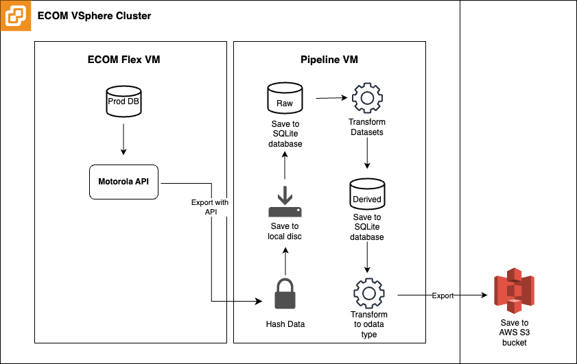

# Data For Community Trust (DCT) ETL Pipeline

## Pipeline Overview
The DCT ETL (Extract, Transform, Load) Pipeline is designed to extract Hazel Crest, IL Police department data from a 
Motorola Spillman Flex database running within a VSphere Cluster. It de-identifies data, performs quality checks, 
transforms data, and uploads data to an AWS S3 bucket to be used in data visualizations. Apache Airflow automates the 
processing workflow, logs all pipeline runs, and deals with error handling and 
alerting.

The pipeline automatically executes each night at 12:00AM CST, and takes roughly 11 minutes to run.

## High-level Pipeline Architecture 

## Data Description
* [Data dictionary for derived tables](./docs/files/data_dictionary_derived_tables.csv)

## Data Flow
Please check out the [DAG file](./dags/dct_hazel_crest_etl_pipeline.py) for details on how data flows through the pipeline.

## Find out More
You can go to the `/docs` folder to find more detailed documentations on the pipeline. Below are links to specific 
sections. 

- [Installation and Setup](./docs/installation_and_setup.md)
- [Architecture Overview](./docs/architecture_overview.md)
- [Usage Guide](./docs/usage_guide.md)
- [Data Description](./docs/data_description.md)
- [Error Handling and Logging](./docs/error_handling_and_logging.md)

# Error Handling and Logging

## Introduction
This document details the error handling mechanisms implemented in our Apache Airflow ETL
pipeline. It also provides an overview of common errors and their solutions in the ETL pipeline.

## Error Logging
Errors within the pipeline are logged with sufficient detail to aid in troubleshooting.
We utilize the following log levels:

- **INFO:** General information about pipeline execution.
- **WARNING:** Non-critical issues that do not halt the pipeline.
- **ERROR:** Critical issues that may cause a task to fail.

Logs are stored in `/home/ripl/airflow/logs`, and are accessible to the pipeline operators.

Pipeline Log Description:
- **dag_id=dct_hazel-crest_etl_pipeline:** This log is automatically created by airflow. It contains logs for each task in the pipeline. 
- **scripts=extract:** Specialized logs for all scripts in the extract folder
- **scripts=load:** Specialized logs for all scripts in the load folder
- **scripts=report:** Specialized logs for all scripts in the report folder
- **scripts=transform:** Specialized logs for all scripts in the transform folder

## Error Notification
We use Apache Airflow to orchestrate our ETL pipeline. The pipeline is segmented into
individual tasks. When a task runs into an issue, the pipeline
pauses for 5 minutes before retrying the task. Should the issue persist, the task
is marked as failed. To keep us immediately informed, we've set up email alerts in Airflow
for any retries, task failures, or DAG failures. The list of alert recipients can be adjusted in
`config.yaml` file under "airflow_defaults"

## Common errors and troubleshooting tips.

### Troubleshoot workflow
#### 1. Scenario 1: Receiving an Error Notification via Email
When you receive an error notification email, it will specify the name of the task that has either failed or is being
retried. To investigate further, you'll need to access the log repository. Directions for finding the log repository
are outlined in the Error Logging section above.

The error notification will include the name of the task that is being retried or failed. Navigate to the log
repository (Log locations can be found under the Error Logging section above). First look for the relavent task log
in `dag_id=dct_hazel-crest_etl_pipeline`, then check the script logs for additional information on the error.

#### 2. Scenario 2: Something seems amiss with the pipeline
When you notice something might be wrong with the ETL pipeline, a practical first step is to examine the pipeline's
status in the Airflow UI. You can find instructions on how to navigate this interface in our
[Usage Guide](./docs/usage_guide.md). This will allow you to review the performance of each task in the most recent run.

If you encounter tasks labeled as "failed" or "upstream failed," it's important to consult the task logs for detailed
insights. A successfully executed pipeline run typically results in tasks being marked as "success" or "skipped."
It's worth noting that a "skipped" status is specific to extraction tasks and occurs when the XML file extracted from
the database does not contain any data.

### Extract Scripts
#### 1. Configuration File Loading Errors
- **Error:** File not found or access issues with `/home/ripl/airflow/config.yaml`.
- **Fix:** Ensure the file exists at the specified path and has appropriate read permissions.

#### 2. Configuration Parsing Errors
- **Error:** YAML parsing errors due to malformed configuration file.
- **Fix:** Verify the YAML file's format for correctness.

#### 3. Directory and Path Issues
- **Error:** Base directory or subdirectories not found.
- **Fix:** Check if directories specified in the configuration exist and have proper permissions.

#### 4. Authentication Errors
- **Error:** Missing or incorrect authentication credentials for API.
- **Fix:** Ensure `config.username` and `config.password` are correctly set.

#### 5. API Request Errors
- **Error:** Network issues, invalid URLs, or server errors during API requests.
- **Fix:** Verify network connectivity, BASE_URL correctness, and server status.

#### 6. XML Parsing Errors
- **Error:** Issues in parsing XML response from the API.
- **Fix:** Ensure valid XML format in API responses and correct implementation of `parse_xml` function.

#### 7. Data Processing Errors
- **Error:** Missing columns in data for hashing, or issues in the hashing process.
- **Fix:** Verify column names in `files_to_hash` and ensure proper implementation of `salted_hash` and `hash_columns` functions.

#### 8. Logging Configuration Issues
- **Error:** Log file not created or not writing logs.
- **Fix:** Check log file paths, permissions, and logging configurations.

#### 9. Exception Handling in Script
- **Error:** Unhandled exceptions causing script failure.
- **Fix:** Implement broad exception handling and specific error handling where necessary.

#### 10. Data Frame Handling Errors
- **Error:** Empty or malformed data frames.
- **Fix:** Validate data frames before processing and handle empty or invalid data appropriately.

#### 11. File I/O Errors
- **Error:** Issues in reading or writing files (e.g., CSV output).
- **Fix:** Ensure file paths are correct and have necessary permissions.

#### 12. External Dependencies
- **Error:** Issues with external libraries or modules.
- **Fix:** Verify all dependencies are installed and up-to-date.

### Load Raw data to SQLite Database
#### 1. Configuration File Loading Errors
- **Error:** File not found or access issues with `/home/ripl/airflow/config.yaml`.
- **Fix:** Verify the existence and accessibility of the configuration file.

#### 2. Directory and Path Issues
- **Error:** Base directory or subdirectories not found.
- **Fix:** Ensure specified directories in the configuration exist and are accessible.

#### 3. Importing Custom Functions
- **Error:** Errors while importing custom functions from the source directory.
- **Fix:** Verify the source directory path and the existence of custom functions.

#### 4. Logging Configuration Issues
- **Error:** Log file not created or not capturing logs.
- **Fix:** Check log file paths, permissions, and logging configurations.

#### 5. File Processing Errors
- **Error:** Errors in listing or accessing files in the specified directory.
- **Fix:** Verify the directory path and file permissions.

#### 6. Database Connection Errors
- **Error:** Failure to establish a connection with the SQLite database.
- **Fix:** Ensure the database path is correct and the database is accessible.

#### 7. SQL Query Generation Errors
- **Error:** Issues in dynamically generating UPSERT queries.
- **Fix:** Validate the logic in `create_upsert_query` and ensure correct table and column names.

#### 8. CSV Processing and Insertion Errors
- **Error:** Errors while reading CSV files or inserting data into the database.
- **Fix:** Check CSV file format, database schema compatibility, and error handling in `process_csv`.

#### 9. Function Specific Errors
   - **get_primary_key:**
     - **Error:** Failure to match file name to a primary key.
     - **Fix:** Verify the file naming convention and primary key mapping logic.
   - **get_table_name:**
     - **Error:** Failure to retrieve the table name based on the file name.
     - **Fix:** Ensure correct pattern matching and table name retrieval logic.

### Transform Scripts
#### 1. Configuration File Loading Errors
- **Error:** Failure to load the configuration file `/home/ripl/airflow/config.yaml`.
- **Fix:** Ensure the file exists and is accessible.

#### 2. Database Connection Errors
- **Error:** Issues establishing a connection to SQLite databases.
- **Fix:** Validate database paths and confirm that the SQLite files are accessible.

#### 3. Data Loading and Transformation Errors
- **Error:** Problems in loading or transforming data tables from the database.
- **Fix:** Check database schema compatibility and ensure correct SQL queries.

#### 4. Data Aggregation and Joining Errors
- **Error:** Errors during data aggregation, filtering, or joining operations.
- **Fix:** Verify data integrity and correctness of data manipulation logic.

#### 5. Writing Data to Database Errors
- **Error:** Difficulties in writing the transformed data back to the database.
- **Fix:** Confirm database write permissions and validate the structure of the data being written.

#### 6. Database Disconnection Errors
- **Error:** Failure to properly close database connections.
- **Fix:** Ensure that database disconnection logic is correctly implemented.

#### 7. Logging Configuration Issues
- **Error:** Logging configuration not capturing script activities adequately.
- **Fix:** Check the logging setup, file paths, and logging levels.

#### 8. Script Execution Flow Errors
- **Error:** Issues in the overall execution flow of the script, particularly in the for-loop for script files.
- **Fix:** Ensure that all scripts in the specified directory are correctly formatted and free of errors.

### Load SQLite to OData and Push to S3

#### 1. Configuration File Loading Errors
- **Error:** Failure to load the configuration file `/home/ripl/airflow/config.yaml`.
- **Fix:** Ensure the file exists and is accessible.

#### 2. Directory and Path Issues
- **Error:** Issues with log directory or file paths.
- **Fix:** Check the existence of directories and validate file paths.

#### 3. Logging Configuration Issues
- **Error:** Logging not capturing events or misconfiguration.
- **Fix:** Review and adjust the logging setup, including file paths and logging levels.

#### 4. Database Operations Errors
- **Error:** Problems in initializing OData interface with the SQLite database.
- **Fix:** Validate the SQLite database file path and ensure it's accessible.

#### 5. AWS IAM Roles Anywhere Session Errors
- **Error:** Failure in establishing IAM Roles Anywhere session for AWS.
- **Fix:** Verify AWS configuration details, including trust anchor ARN, profile ARN, and role ARN.

#### 6. AWS S3 Client Configuration Errors
- **Error:** Issues in configuring or using the AWS S3 client.
- **Fix:** Check the boto3 session configuration and AWS credentials.

#### 7. File Processing and Upload Errors
- **Error:** Errors during the processing of data or uploading files to S3.
- **Fix:** Confirm the temporary directory handling, file formats, and S3 bucket details.

#### 8. General Script Execution Errors
- **Error:** Unhandled exceptions or issues in the script's execution flow.
- **Fix:** Implement broad exception handling and monitor for specific error patterns.
