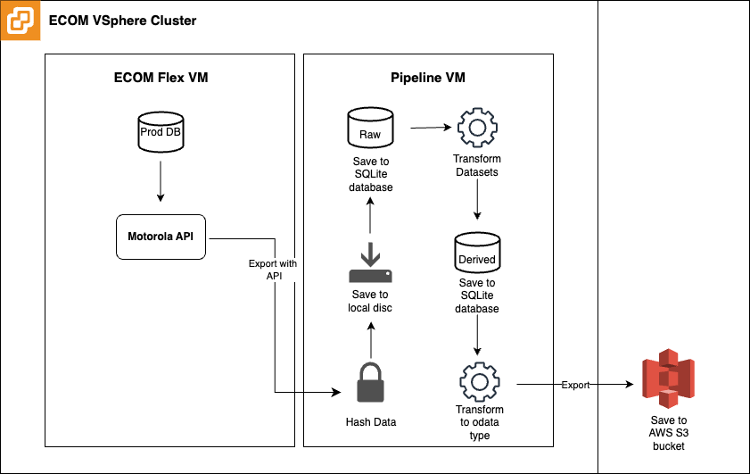

# Architecture Overview

## ETL Diagram.

**Note**: Code in this repository is for the ETL Pipeline only. 

## SQLite Database
* [SQLite database schema set-up raw tables](../scripts/schema/schema_database_setup_raw_tables.py)
* [SQLite database schema set-up derived tables](../scripts/schema/schema_database_setup_derived_tables.py)
