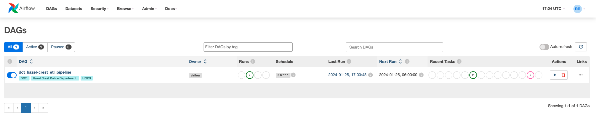
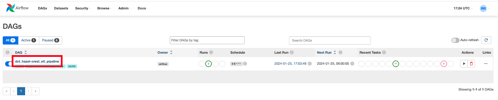
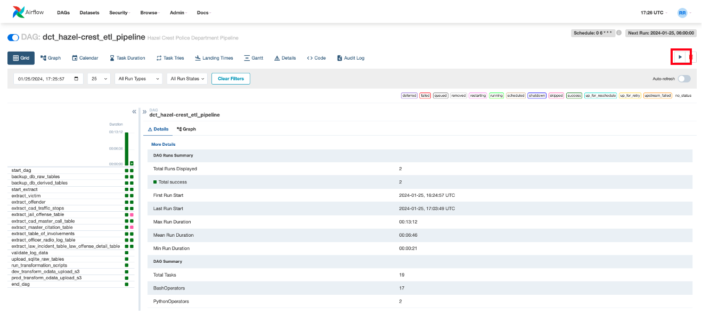
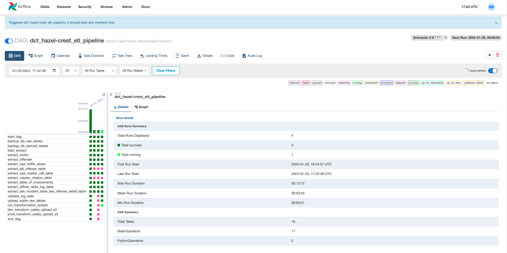
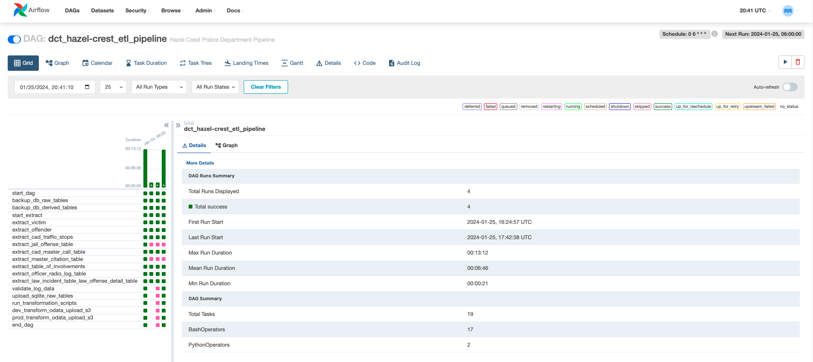

# Usage Guide

## How to Start Airflow
**NOTE:** If you've set up Airflow as a system service (as suggested in the [Instillation and Setup Guide](./installation_and_setup.md) please skip this step. 
  - Run airflow Webserver: 
      ```
      airflow webserver
      ```

  - Run airflow Scheduler:
      ```
      airflow scheduler
      ```
 
  - Run airflow Worker:
      ```
      airflow celery worker
      ```

## How to run the ETL pipeline
1. Connect to airflow in a browser: http://hostname:8080/
    **NOTE**: "hostname" should be replaced with either the VM's host name or the ip address.
   
    

1. Click on the name of the dag. The DCT Pipeline dag is named 'dct_hazel-crest_etl_pipeline' 
    

1. Manually trigger the dag by clicking the play button 
    

    Airflow should now be running. In the upper-left hand corner of your screen you should see the words "Triggered dct_hazel-crest_etl_pipeline, it should start any moment now." In the grid to the left of the screen, you should now see a new pipeline run start. 
    

1. Check that the dag ran sucessfully. In the grid on the left-hand side of the page, you can hover over the latest dag run to check the status of the run. Check that the Status is marked as "Success." Please note, each task in the pipeline also has it's own status. You can hover over each individual square (representing a specific task) to see it's status. You can also determine status by color (there is a color legend in the upper-right hand corner of the page). 
    

